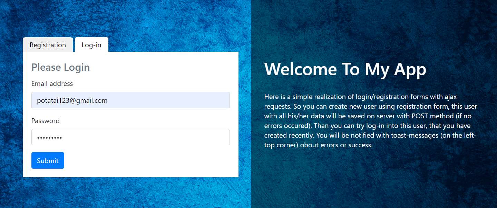
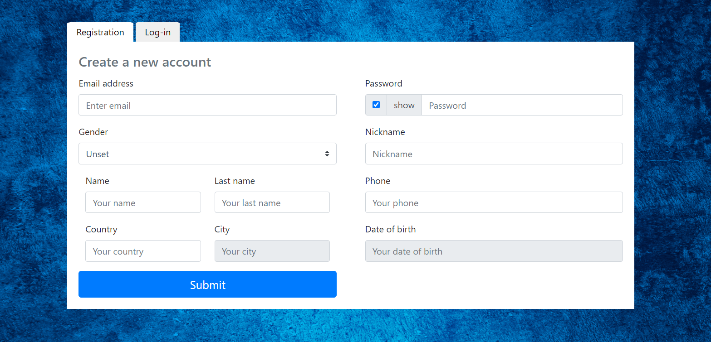

# Log-in + Register
> Simple realization of ajax POST and GET methods to create the possibility of registration and login.
#### GItHub pages : [check it out!](https://ic3top.github.io/Log-in/dist/)
## Table of contents
* [General info](#general-info)
* [Screenshots](#screenshots)
* [Technologies](#technologies)
* [Status](#status)

## General info
Here is a simple realization of login/registration forms with ajax requests. So you can create new user using registration form, this user with all his/her data will be saved on server (as a Heroku) with POST method (if no errors occured). Than you can try log-in into this user, that you have created recently. You will be notified with toast-messages (on the left-top corner) about errors or success.

## Screenshots

## Technologies
* bootstrap: 4.3.1,
* axios: 0.19.0,
* js-datepicker: 5.18.0

## Status
Project is:  _finished_
